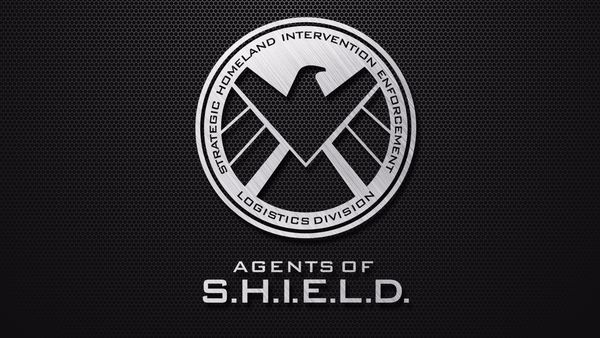

# Agents of S.H.I.E.L.D.

    

Collection of my favorite lines.

[Subtitle Link](http://transcripts.foreverdreaming.org/viewforum.php?f=140)
## Season 1 Episode 14

>**Doctor**  
>We can keep her comfortable, but you'll need to make a decision on whether or not you want to keep her on life support.  
>**Coulson**  
>You're saying there's nothing to be done?  
>**Doctor**  
>I'm saying you need to call her family and get them here as soon as possible.  
>**Coulson**  
>We are her family.  

## Season 1 Episode 15

>**Coulson**:   
> I know nothing fazes you, but this should faze you.   
> We are completely dark on this.    
>**Skye**:    
>That's where we live.     
>I'm an 0-8-4. Who knows what the hell that means.  
>At least we are in the dark together.  
>**Coulson**:   
>Yes. But not for long.   
>To hell with any protocols or any codes I used to be bound by.  
>We have a long list of questions we need answers for and we are going after them ourselves.  

>**BG**  
>Encrypted line secure.  
>**May**  
>Update log 93.  
>He knows. I repeat... Coulson knows.  

## Season 1 Episode 21

>**Coulson**  
>I'll be damned if I'm gonna let Garrett and Ward get away with murder.  
>And I want my plane back.

>**Garrett**  
>Out here, son, if you want something, you have to earn it.   
>For here on out, you earn everything.   
>You want a warm place to sleep, you make it.   
>You want something to eat, you kill it.  

## Season 2 Episode 4

>**Coulson**    
>But I need you to forget all that... and kill me as ordered.  
>**May**    
>What?  
>**Coulson**   
>You said it yourself ... I'm not getting better.   
>I don't want to end up like Garrett, and taking me to some cabin won't change my brain.  
>**May**     
>I'll find a way.  
>**Coulson**   
>May... Nostalgia's fine, but then life happens. It's time to deal with reality.  
>**May**    
>Phil...please.  
>**Coulson**    
>Hard choices are coming. I need you to make this one... for me.  

## Season 2 Episode 11

>**Skye**  
>We lost.   
>We failed.  
>**Coulson**   
>Skye, don't say that.   
>**Skye**    
>It wasn't because of HYDRA. It was because of me.  
>**Coulson**  
>Don't blame yourself.   
>**Skye**  
>If I didn't go down there, you could have blown the place!   
>**Coulson**  
>That was one battle. This is a war.   
>**Skye**  
>And Ward and my father ... - The rotten core   
>**Coulson**  
>Skye...   
>**Skye**  
>at the center of everything!  
>**Coulson**  
>We did not fail! Trip prevented a disaster, and Whitehall's dead.   
>We cut off the head.   
>And while HYDRA scrambles for a new one, I will crush them!   
>I'm gonna make somebody pay ... whoever the hell it is.  

## Season 2 Episode 12

>**Kava(the kree)**   
>Your friend Skye is an atrocity, and I must go put an end to this.  
>**Mike**  
>We'll decide what she is. But for now, you're not going anywhere.  
>**Kava**  
>This is not your fight.  
>**Mike**  
>It kind of is now.  

